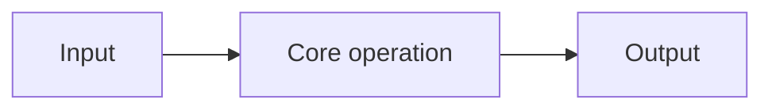

# {{title}}

## Purpose

What reusable concept, algorithm, device, or engineering idea does this implementation realize?

## Mathematical / engineering contract

Describe what the implementation **must accomplish**, independently of programming language or repository structure.

Include the governing equations, invariants, interfaces, physical requirements, or algorithmic guarantees needed to implement the idea correctly.

## Inputs and outputs

### Inputs

- 

### Outputs

- 

## Algorithm / portable pseudocode

Write enough pseudocode or structured algorithm detail that a competent engineer could create an independent implementation without copying the original source code.

```text
1. ...
2. ...
3. ...
```

## Important assumptions and invariants

Record details that are easy to lose when porting the implementation, for example:

- function spaces or discretization assumptions,
- coordinate/geometry mappings,
- units and normalization,
- complex-conjugation conventions,
- orientation/sign conventions,
- quadrature/integration requirements,
- boundary/edge-case behavior,
- data ordering that is mathematically meaningful.

## Transferability

### Portable / method-independent pieces

What can be reused conceptually in another solver, language, or codebase?

### Method/domain-specific pieces

What is specific to this method/domain and must be re-derived or replaced when moving elsewhere?

### Repository-specific pieces

What exists only because of this repository's API, array layout, class hierarchy, performance choices, or other software architecture?

## Required computational objects

| Mathematical / engineering object | Computational role | Notes / invariants |
|---|---|---|
| | | |

## Code map

| Requirement / object | File | Symbol / function / class | Validation / test |
|---|---|---|---|
| | | | |

Use repository-relative paths. The source code, not this table, is authoritative for current behavior.

## Data flow



## Reference implementation provenance

- Repository: `repo-name`
- Remote: `repo-url`
- Last verified commit: `last-verified-commit`
- Source inspection policy: `source-inspection`

### Inspect the original repository when

List cases where the implementation note is intentionally insufficient and the source should be inspected, such as:

- reproducing exact numerical behavior,
- checking edge cases or conventions,
- regression matching,
- resolving ambiguity in the pseudocode,
- verifying behavior after the recorded commit.

If the referenced repository is not already accessible to Claude, add it with `/add-dir /path/to/repo` or restart Claude with an additional `--add-dir` argument. Treat a reference repository as read-only unless the user explicitly asks to modify it.

## Deviations from literature / canonical concept

Separate deliberate implementation choices from requirements of the source method.

## Validation

Record tests, convergence studies, reference values, experiments, or other evidence that demonstrate correctness.

## Known limitations

## Porting notes

When reusing this idea elsewhere, explicitly state what should be carried over and what must be re-derived for the target method/domain.

## Open work
